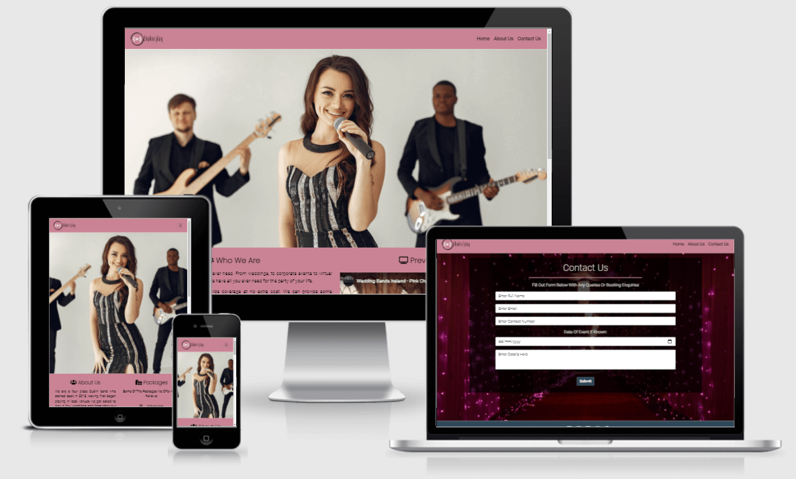

<h1 align="center"><b>Shakin'play Website</b></h1>

[Click Here To View Live Project](https://rcass172.github.io/shakin-play/)

## <u>UX</u>

### Project Goals
The primary goal of this website is to give all the relevant information to a user in an appealing and simple way. The site is designed 
to be as clear and easy to use while also looking professional to help stand out from other competitors.

### User Goals

* Easy to use on mobile, tablet and desktop
* Visually appealing
* Relevant content
* Easy to navigate to seperate sections
* Contact details easy to find
* Testimonials and information to showcase what they offer

### Business Goals

* Stand out from other competitors
* Showcase what they can provide
* Professional looking website
* Increase bookings

### User stories

As a user i would like:

1. To see testimonials of what other people thought about their service
2. To be able to navigate easily from each page
3. Visual icons easy to understand and recognise
4. An easy to use yet visually appealing website
5. The webite to look good regardless of what device i use
6. To feel like the business is professional by the look and feel of website
7. The feeling that this business is better than other competitors to help decide on booking
8. Social media links present so i can investigate further if needed
9. Any links i click on to open in a new tab
10. Information to show what they can do
11. To be able to easily contact the business
12. To learn more about their history

### Design

* Two colors were used in the project. A type of corral and off white which matched the hero image background to help the page flow. 
 Bright colors used to make it look clean and enticing to the user.
* A large Hero image used to help get attention of user and showcase a modern look of the band to help stand out from competitors.

### Wireframes

Balsamiq was used to showcase the initial wireframe of website on mobile, tablet and desktop - [View Here](https://github.com/RCass172/shakin-play/blob/master/wireframe/wireframe.pdf)

## <u>Features</u>

* Reponsive on all different device sizes
* Call to action buttons used to help increase bookings
* iframe used to showcase the bands performance
* upcoming showcase with modal to register
* social media links in footer for users to investigate further

## <u>Technologies Used</u>

### Languages

* [HTML](https://en.wikipedia.org/wiki/HTML)
* [CSS](https://en.wikipedia.org/wiki/CSS)
* [JavaScript](https://en.wikipedia.org/wiki/JavaScript) (via Bootstrap)

### Frameworks/Libraries/Programs

* [Bootstrap 4.3.1](https://getbootstrap.com/docs/4.3/getting-started/introduction/) - used for responsive pages 
* [Fontawesome](https://fontawesome.com/)- used for aesthetics 
* [TinyPNG](https://tinypng.com/) - used to compress images for better performance
* [Google Fonts](https://fonts.google.com/) - roboto font used throughout all pages with poppins font used on headings, imported to the style.css file
* [Balsamiq](https://balsamiq.com/) - used to create initial wireframes
* [Git](https://git-scm.com/) - used for version control
* [Gitpod](https://www.gitpod.io/) - used to write code before pushing to GitHub for storage

## <u>Testing</u>

### Testing User Stories

### Bugs

## <u>Deployment</u>

This project was deployed to GitHub pages by executing the following steps:

1. Open GitHub and find relevant [repository](https://github.com/RCass172/shakin-play).
2. Navigate to the <b>settings</b> tab and scroll down to <b>pages</b>.
3. Under <b>source</b> heading click the none dropdown and select <b>master branch</b> and save.
4. When page refreshes the website is now live and found when you click <b>settings</b> > <b>pages</b> > <b>Your site is published at </b>[link](https://rcass172.github.io/shakin-play/)

To run project locally:

1. Open GitHub and find relevant [repository](https://github.com/RCass172/shakin-play).
2. Click the download code dropdown.
3. Using the clone HTTPS option copy the link provided.
4. Open Git Bash and change working directory to location where you want cloned directory to go.
5. Type <b>git clone</b> command and paste the clone link you had copied.

## <u>Credits</u>